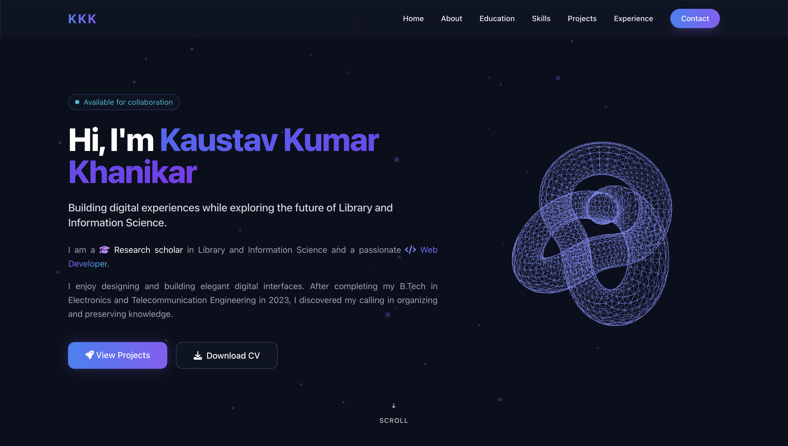
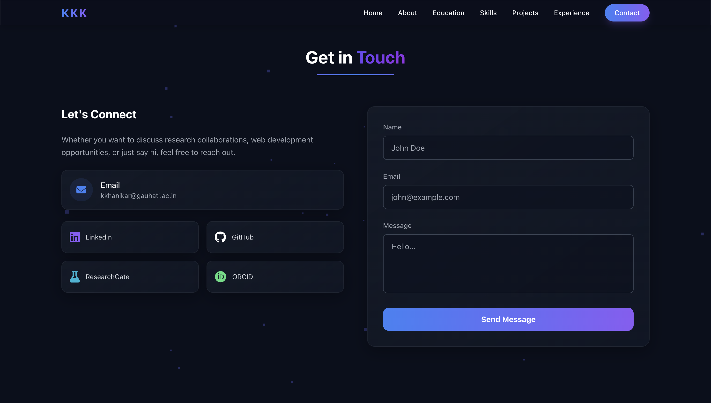
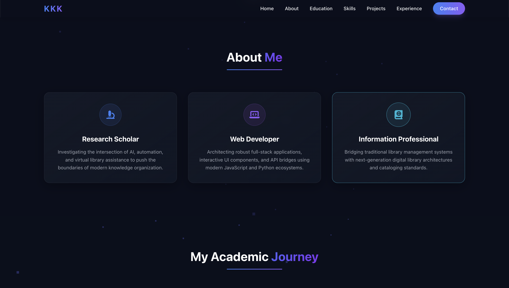

# KaustavKhanikar
Personal Protfolio Website
# 🌌 Kaustav Khanikar | Personal Portfolio Website


Welcome to the source repository of my personal engineering portfolio! This website functions as an immersive, highly scalable visual resume curated to showcase my ongoing technical projects, academic research milestones, and core software engineering skillset through a cohesive, responsive web presentation layer.

---

## 📸 Interface Showcase

Here is a comprehensive look at the interface layouts and design components utilized throughout the platform:

### 🖥️ Primary Desktop Interface
A macro view showcasing the glassmorphism UI structures, core neon accent styling layout configurations, and main landing hero sections:
<p align="center">
  
</p>

### 📱 Glance at the rest
A quick preview of the about and contact section:
<p align="center">
  
  
</p>

---

## 🚀 Key Features

*   **Glassmorphism Theme System:** Styled using custom `backdrop-filter` utility configurations embedded natively in a premium dark-navy theme.
*   **Zero-Server Contact API:** Integrated seamlessly with a tailored **Google Apps Script & Gmail automation pipeline** running in the background to forward user communications directly into an inbox.
*   **Hardware Accelerated UI Transitions:** Interactive card blocks leverage advanced groups `transform-style-3d` animations paired with clean text swapping layout states on component hover.
*   **Fluid Side Navigation Drawer:** Mobile menu states use optimized translation vectors (`translate-x-full`) to deliver lightning-fast sliding experiences on mobile glass layouts.

---

## 🛠️ Core Technology Stack

*   **Markup Structure:** HTML5
*   **Styling Engine:** Tailwind CSS
*   **Component Interaction Code:** Vanilla JavaScript (ES6+)
*   **External Integration Engines:** Font Awesome Vectors, Google Apps Script API

---

## 📦 Local Architecture Layout

```bash
├── bucket/                     # Asset depository holding layout preview snapshots
│   ├── Screenshot1.png         # Hero section
│   ├── Screenshot2.png         # About section
|   ├── ...............
│   └── Screenshot8.png         # Contact section
├── index.html                  # Core portfolio template layout presentation file
└── README.md                   # Repository documentation layer
```

---

## 📥 Local Deployment Quickstart

Follow these steps to run a local development copy of this portfolio website on your computer:

1. **Clone the repository:**
   ```bash
   git clone https://github.com
   ```

2. **Navigate into the project workspace directory:**
   ```bash
   cd KaustavKhanikar
   ```

3. **Launch the application interface:**
   Simply double-click the `index.html` file to initialize the presentation file using any modern framework browser layer. Or launch via VS Code using the **Live Server** extension wrapper.

---

## 📝 License

Distributed under the terms of the open-source **MIT License**. Check out the repository documentation parameters for more explicit compliance terms.
